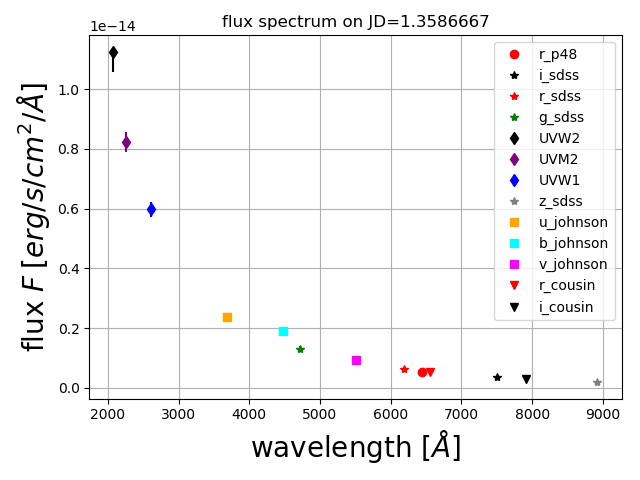
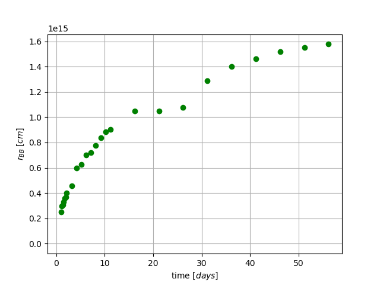
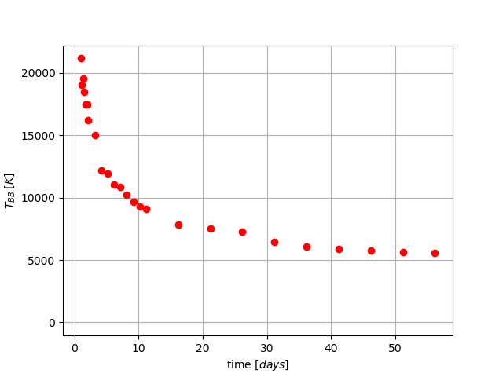

# PhotoFit
This package is for calculating and visualizing the evolution in time of the effective radius, temperature and luminosity of a supernova (or any target assumed to behave as a blackbody) from multiple-bands photometry.

[](https://pypi.python.org/pypi/PhotoFit)

## Documenation

`PhotoFit` is a package to model the effective radius and temperature from multiple-bands photometry of a supernova.

### How does PhotoFit work?

1. Measurements in different bands are usually taken at different epochs. The first task completed by `PhotoFit` is to interpolate the flux and (more tricky) the errors on
common epochs defined by the user. `PhotoFit` does this task using Monte Carlo Markov Chains (MCMC) simulations. This first step can be time-consuming (~0.5 min per band and per epoch),
but you can set the parameters (in the parameters file `params.py`) to only do this once for a given data set.
At the end of this first step, there is one spectral energy distribution (SED) to fit per epoch.

2. `PhotoFit` then fits each SED with a blackbody model after:
    - correcting for the extinction: `PhotoFit` does this using [Schlafly & Finkbeiner (2011)](https://ui.adsabs.harvard.edu/#abs/2011ApJ...737..103S/abstract) and using the extinction curves of [Cardelli et al. (1989)](https://ui.adsabs.harvard.edu/#abs/1989ApJ...345..245C/abstract).
    - correcting for the redshift
    - correcting for the effect of the filters transmission curves: `PhotoFit` does this using the `pyphot` package for synthetic photometry.

3. The fit itself can be done in two different ways (to be chosen by the user and defined in the `params.py` file):
    - Monte Carlo Markov Chain simulations (with [emcee](http://dfm.io/emcee/current/)). The advantage of this option is it gives you error bars on T and R. The disadvantage is that it is time-consuming
(~30 min per epoch for 100 walkers and 350 steps)
    - A linear fit with a grid of temperatures. The advantage of this method is its speed. The disadvantage is the lack of error bars.

## Credit

If you are using PhotoFit, please reference the appendix of Soumagnac et al. 2019 (in preparation)

## How to install `PhotoFit`?

### pip

`pip install PhotoFit`

### Python version
* `python 3`

### Required python packages
* `math`
* `numpy`
* `pylab`
* `emcee`
* `matplotlib`
* `pyphot`

## How to run `PhotoFit`?

### Edit the params.py file

The first step is to edit the content of the parameters file `params.py` as detailed in [this section](https://github.com/maayane/PhotoFit/blob/master/README.md#the-parameters-file-in-details). Unless you want to give it a try with the default parameters, which allow you to run `PhotoFit` on the test data from PTF 13dqy ([Yaron et al 2017](https://ui.adsabs.harvard.edu/#abs/2017NatPh..13..510Y/abstract)), as explained [here](https://github.com/maayane/PhotoFit/blob/master/README.md#give-it-a-try-with-the-test-data).

### Calculate the evolution of R and T

The simplest way to run PhotoFit is
```python
>>> import PhotoFit
>>> import params_test as params
>>>Best=PhotoFit_fun.calculate_T_and_R_in_time(data_file=params.data_file,dates_file=params.dates_file,already_run_interp_errors_from_param=params.already_run_interp_errors,already_run_mcmc=params.already_run_mcmc,already_run_matrix=params.already_run_matrix,num_iterations=params.num_iterations,show_underlying_plots=True,verbose=False,redshift=params.z,distance_modulus=params.distance_modulus,explosion_date=params.explosion_date,EBV=params.EBV,output=params.output,filters_directory=params.filters_directory,mcmc=params.mcmc,output_file_interpolation=params.output_file_interpolation,lower_limit_on_flux=params.lower_limit_on_flux,csm=params.csm,num_steps=params.num_steps,nwalkers=params.nwalkers)
```

`Best` is a numpy array of which the first column is the time (jd), the second column is the temperature (K) and the third column is the radius (cm).

By default, the code shows and save plots generated while running. They are interesting, but if you do not want to see or save them, you can set `show_underlying_plots` to `False`

And if you want the code to tell you more about what it is doing at each step, you can set `verbose` to `True`:

The `Best` numpy array, containing the time evolution of T and R, is stored in your output directory (defined in the `params.py` file), in a file called `Results.txt`. In addition to this file, the code creates in your output directory one sub-directory per epoch, with several files and plots. In particular, the plot stored in `SED_date_X.XXX.pdf`(left) shows the infered SED at epoch X.XXX and the plot stored in `fit_result_FLux.pdf` (right) shows the data and best-fit model superimposed.

<p align="center">
  
  
</p>

The results of the interpolation (see step 1. of [How does PhotoFit work](https://github.com/maayane/PhotoFit/blob/master/README.md#how-does-photofit-work)) are stored in a dedicated directory defined in the `params.py` file. For a good interpolation, the green and blue points on the plot stored in `Plot_w_interpolated_errors.pdf` (right) must be almost exactely or exactely superimposed.

<p align="center">
  
  
</p>


### Visualize the evolution of R and T

The simplest way to visualize the evolution of R and T is simply to run 

```python
>>> PhotoFit_fun.plot_T_and_R_in_time(Best,output=params.output)

```

If you want to compare the temperature and radius to those of another object, just tell `PhotoFit` where to look for this additional data (buy setting the  `data_compare` pparameter in `params.py`) and run

```python
>>> PhotoFit_fun.plot_T_and_R_in_time(Best,data_compare=params.data_compare,compare=False,label_comparision='PTF13dqy',output=params.output)

```

<p align="center">
  
  
</p>

### Visualize the evolution of L

```python
>>>PhotoFit_fun.plot_L_in_time(Best,data_file=params.data_file,lower_limit_on_flux=params.lower_limit_on_flux,dates_file=params.dates_file,error_lum_ran=False,explosion_date=params.explosion_date,output=params.output,mcmc=params.mcmc,output_file_interpolation=params.output_file_interpolation)

```

<p align="center">
  
</p>

If you have done the fit using mcmc, `PyPhot` will calculate the errors on the luminosity L. To avoid doing this again and again after the first time you ran `PhotoFit.`, set the `error_lum_ran` to `True`:

### Visualize the spectral energy distributions (SEDs) at each epoch

To visualize all the SEDs on one 2-D plot, run

```python
>>>PhotoFit_fun.plot_SEDs(Best,already_interpolated=True,data_file=params.data_file,lower_limit_on_flux=params.lower_limit_on_flux,dates_file=params.dates_file,already_run_interp_errors_from_params=params.already_run_interp_errors,number_of_plot=9,redshift=params.z,distance_modulus=params.distance_modulus,explosion_date=params.explosion_date,output=params.output,filters_directory=params.filters_directory,output_file_interpolation=params.output_file_interpolation,EBV=params.EBV)
 
```
<p align="center">
  
</p>

The default number of plots is 9 (PhotoFit will pick epochs evenly spread over the total range of time). You can show 16 SEDs instead by editing the `number_of_plot` parameter:

```python
plot_SEDs(Best,number_of_plot=16)  
```
<p align="center">
  
</p>

## The parameters file in details

Let's dive into the parameters file in full details. You can look at the example file `params_test.py` containing parameters used by `script_test.py`, the main code, to run. 

Below is a list of the parameters to edit. The parameters not detailed below are **not** to be edited.
If you do not edit the parameters listed below and simply run `PhotoFit`, it will run on the test data of PTF 13dqy ([Yaron et al 2017](https://ui.adsabs.harvard.edu/#abs/2017NatPh..13..510Y/abstract)) (see the [section on the test data](https://github.com/maayane/PhotoFit/blob/master/README.md#give-it-a-try-with-the-test-data)).

* `mcmc` - a **boolean** determining the fitting method (see step 3 of the section [How does PhotoFit work?](https://github.com/maayane/PhotoFit/blob/master/README.md#how-does-photofit-work)). If set to `False`, it will use a linear fitting method. If `True`, it will run MCMC (much more time consuming, but with the advantage of providing error bars on) 
* `output_file_mcmc` - a **string** determining the path of the directory where you intend to put your results, if `mcmc=True`. Default is `'./test/results_fit_sed_mcmc'`, for running `PhotoFit` on the test data.
* `output_file_linear` - a **string** determining the path of the directory where you intend to put your results, if `mcmc=True`. Default is `'./test/result_fit_sed_mat'`, for running `PhotoFit` on the test data.
* `output_file_interpolation` - a **string** determining the path of the directory where `PhotoFit` wiill store the results of the interpolation step (see step 1 of the section [How does PhotoFit work?](https://github.com/maayane/PhotoFit/blob/master/README.md#how-does-photofit-work)). Default is `'./test/results_interpolation'`, for running `PhotoFit` on the test data.
* `z` - a **float** with the redshift of your object (see step 2 of the section [How does PhotoFit work?](https://github.com/maayane/PhotoFit/blob/master/README.md#how-does-photofit-work)).
* `distance_modulus` - a **float** with the distance_modulus of your object
* `explosion_date` - a **float** with the explosion date of your object, in the same units as in your data file.
* `EBV` - a **float** with the extinction to correct for (see step 2 of the section [How does PhotoFit work?](https://github.com/maayane/PhotoFit/blob/master/README.md#how-does-photofit-work)).
* `data_file`- a **string** determining the path to your data file. The file must have four fields: time (in jd), flux (in erg/s/cm^2/A), errors on the flux and filter name. It must have a header **with the fields written in the following way**: jd,flux,fluxerr,filter (**PhotoFit will not run properly if the header is not written properly**). The filter names have to be from the following list ('UVW1','UVW2','UVM2','u_swift','v_swift','b_swift','g_sdss','r_sdss','i_sdss','z_sdss','r_cousin','i_cousin','h_2mass','j_2mass','u_johnson','b_johnson','v_johnson').
* `dates_file` - a **string** determining the path to a file with the common epochs (in jd) at which you want to interpolate the data (see step 1 of the section [How does PhotoFit work?](https://github.com/maayane/PhotoFit/blob/master/README.md#how-does-photofit-work)).
* `lower_limit_on_flux` - a **float**. Only fluxes values above this limit will be considered as real points. This is important in case you have e.g. mag=99 in you original data, as wrong fluxes values can mess up the interpolation. 
* `already_run_interp_errors[name of the filter]`- a **boolean**, that allows you to save time and not re-run the interpolation step at every run of `PhotoFit`. Set this parameter to `False` if the interpolation for this band has NOT been done yet. The interpolation step has already been performed for the test data, so you can simply leave it as `False` for testing the code (see the [section on the test data](https://github.com/maayane/PhotoFit/blob/master/README.md#give-it-a-try-with-the-test-data). 
* `already_run_matrix`- a **boolean**. This is only to be edited if `mcmc=False`, i.e. if you are using the linear fit method. Set to `True` after the first run, if you want e.g. to visualize the results stored in `Results.txt`, to avoid redoing the fit. The fit has already been performed for the test data, so you can simply leave it as `False` for testing the code (see the [section on the test data](https://github.com/maayane/PhotoFit/blob/master/README.md#give-it-a-try-with-the-test-data))
* `num_iterations`- a **float**. This is only to be edited if `mcmc=False`, i.e. if you are using the linear fit method. Determines the number of temperatures in the grid. 
* `already_run_mcmc` - a  **boolean**. This is only to be edited if `mcmc=True`, i.e. if you are using the mcmc fit method. Set to `True` after the first run, if you want e.g. to visualize the results stored in `Results.txt`, to avoid redoing the fit.
* `nwalkers` -  a **float**. This is only to be edited if `mcmc=True`, i.e. if you are using the mcmc fit method. Determines the number of walkers in the mcmc. See the [emcee documentation](http://dfm.io/emcee/current/) for details.
* `num_steps` - a **float**. This is only to be edited if `mcmc=True`, i.e. if you are using the mcmc fit method. Determines the number of walkers in the mcmc. See the [emcee documentation](http://dfm.io/emcee/current/) for details.
* `data_compare` - a **string**. This is in case you want to compare your R and T results with existing results from a file while visualizing them (see the [section on visualizing R and T](https://github.com/maayane/PhotoFit/blob/master/README.md#visualize-the-evolution-of-r-and-t)). This parameters determines the path to this file, which needs to have no header and the following format: column#1 - time from explosion, column#2 - temperature (K), column#3 -radius (cm). The default parameter will make you compare your results with the supernova PTF 13dqy. 


## Give it a try with the test data!

All the figures above were obtained by running `PhotoFit` on the multiple-bands light curve of the Supernova PTF13dqy ([Yaron et al 2017](https://ui.adsabs.harvard.edu/#abs/2017NatPh..13..510Y/abstract)). The data is available in the `test` directory (including the output of the time-consuming interpolation step). You can reproduce all these results and figures by running `PhotoFit` with the parameters file `params_test.py` as it is.


