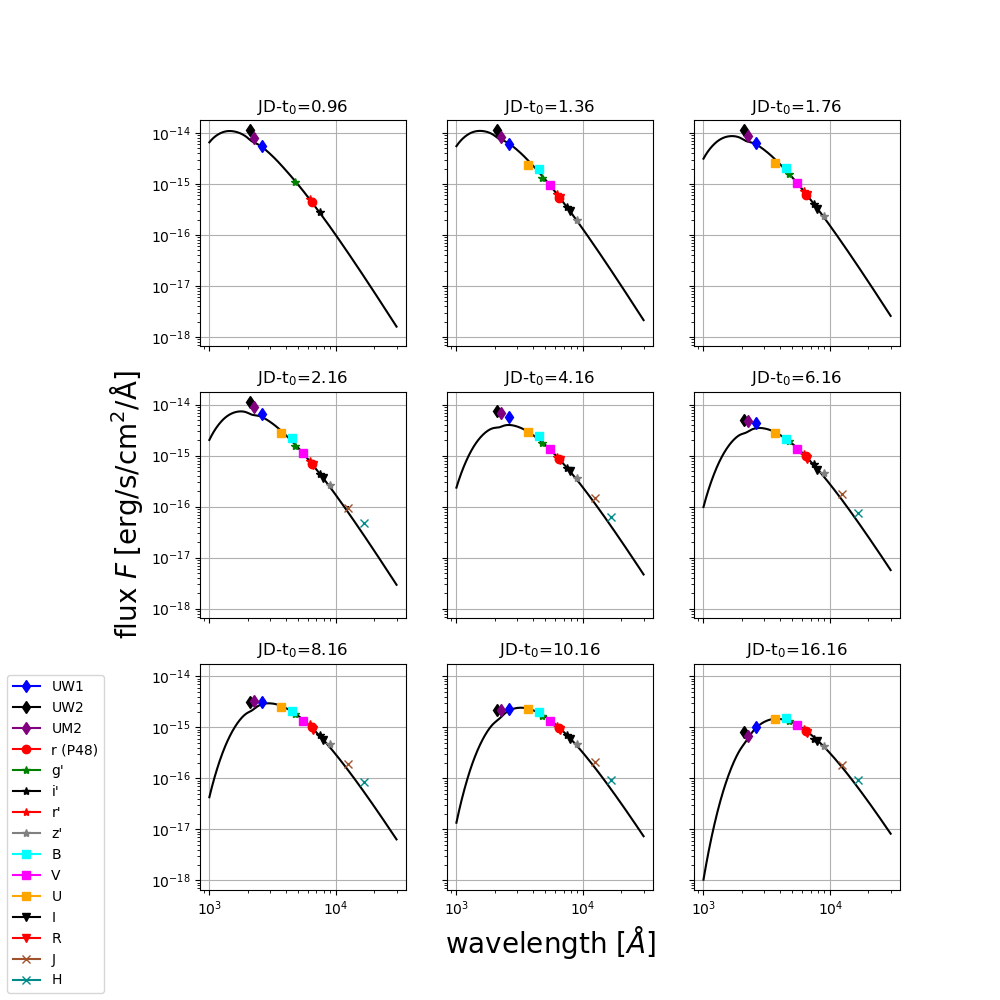

# PhotoFit
This package allows you to calculate and visualize the evolution in time of the effective radius, temperature and luminosity of a supernova from multiple-bands photometric light-curves.

[](https://pypi.python.org/pypi/SLAB-Diffusion)

```python
>>> import PhotoFit
>>> PhotoFit.calculate_T_and_R_in_time()
```

## Documenation

`PhotoFit` is a package to model the effective radius and temperature from multiple-bands photometry of a supernova.

### How does PhotoFit work?

1. Measurements in different bands are usually taken at different epochs. The first task completed by `PhotoFit` is to interpolate the flux and (more tricky) the errors on
common epochs defined by the user. `PhotoFit` does this task using Monte Carlo Markov Chains (MCMC) simulations. This first step can be time-consuming (~0.5 min per band and per epoch),
but you can set the parameters (in the parameters file `params.py`) to only do this once for a given data set.
At the end of this first step, there is one spectral energy distribution (SED) to fit per epoch.

2. `PhotoFit` then fits each SED with a blackbody model that has been corrected for:
    - the extinction: `PhotoFit` does this using Schlay & Finkbeiner (2011) and using the extinction curves of Cardelli et al. (1989).
    - the redshift
    - the effect of the filters transmission curves: `PhotoFit` does this using the `pyphot` package for synthetic photometry.

3. The fit itself can be done in two different ways (to be chosen by the user and defined in the `params.py` file):
    - Monte Carlo Markov Chain simulations (with emcee). The advantage of this option is it gives you error bars on T and R. The disadvantage is that it is time-consuming
(~30 min per epoch for 100 walkers and 350 steps )
    - A linear fit with a grid of temperatures. The advantage of this method is its speed. The disadvantage is the lack of error bars.

## How to install `PhotoFit`?

### pip

`pip install PhotoFit`

### Python version
* `python 2`: higher than `2.7.10`
* `python 3`

### Required python packages
* `math`
* `numpy`
* `pylab`
* `emcee`
* `matplotlib`
* `pyphot`

## How to run `PhotoFit`?

### Edit the params.py file

The content of the parameters file `params.py` is fully detailed in the section [The parameters file in details](https://github.com/maayane/PhotoFit/blob/master/README.md#the-parameters-file-in-details).

After every modification of `params.py`, rerun

```python
>>> python setup.py install
```
from your `PhotoFit` directory

### Calculate the evolution of R and T

The simplest way to run PhotoFit is
```python
>>> import PhotoFit
>>> Best=PhotoFit.calculate_T_and_R_in_time()
```
`Best` is a numpy array where the first column is the time (jd), the second column is the temperature (K) and the third column is the radius (cm).

By default, the code show and save the plots. If you do not want to see and save these plots, you can set `show_underlying_plots` to `False`, i.e. run

```python
>>> Best=PhotoFit.calculate_T_and_R_in_time(show_underlying_plots=False)
```
And if you want the code to tell you more about what it is doing at each step, you can set `verbose` to `True`:

```python
>>> Best=PhotoFit.calculate_T_and_R_in_time(verbose=True)
```
The `Best` numpy array, containing the time evolution of T and R, is stored in your output directory (defined in the `params.py` file), in a file called `Results.txt`. In addition to this file, the code creates in your output directory one sub-directory per epoch, with several files and plots in it. In particular, the plot stored in `SED_date_X.XXX.pdf`(left) shows the infered SED at epoch X.XXX and the plot stored in `fit_result_FLux.pdf` (right) shows the data and best-fit model superimposed.

<p align="center">
  
  
</p>

The results of the interpolation (see step 1. of [How does PhotoFit work](https://github.com/maayane/PhotoFit/blob/master/README.md#how-does-photofit-work)) are stored in a dedicated directory defined in the `params.py` file. For a good interpolation, the green and blue points on the plot stored in `Plot_w_interpolated_errors.pdf` (right) must be almost exactely or exactely superimposed.

<p align="center">
  
  
</p>


### Visualize the evolution of R and T

The simplest way to visualize the evolution of R and T is simply to run 

```python
>>> PhotoFit.plot_T_and_R_in_time(Best)
```

If you want to compare the evolution of R and T to the one of an other object, set the path to the file to be compared in the `params.py` file and run

```python
>>> PhotoFit.plot_T_and_R_in_time(Best,compare=True,label_comparision='PTF 13dqy')
```

<p align="center">
  
  
</p>

### Visualize the evolution of L

```python
>>> PhotoFit.plot_L_in_time(Best)
```

<p align="center">
  
</p>

If you have done the fit using mcmc, `Pyphot` will calculate the errors on the luminosity L. To avoid doing this again and again after the first time you ran `PhotoFit.` , set the `error_lum_ran` to `True`:

```python
>>> PhotoFit.plot_L_in_time(Best)
```

### Visualize the spectral energy distributions (SEDs) at each epoch

To visualize all the SEDs on one 2-D plot, run

```python
>>> plot_SEDs(Best)  
```
<p align="center">
  
</p>

The default number of plots is 9 (PhotoFit will pick epochs evenly spread over the total range of time). You can show 16 SEDs instead by editing the `number_of_plot` parameter:

```python
plot_SEDs(Best,number_of_plot=16)  
```
<p align="center">
  
</p>

## The parameters file in details

Let's dive into the parameters file in full details. The file `params.py` contains parameters used by `script.py`, the main code, to run. Don't forget to run 
```python
>>> python setup.py install
```
after each edit!

Below is a list of the paraeters with an explanation.

* `mcmc` - This is a **boolean** determines the fitting method (see step 3 of the section [How does PhotoFit work?](https://github.com/maayane/PhotoFit/blob/master/README.md#how-does-photofit-work)). If set to `False`, it will use a linear fitting method. If `True`, it will run MCMC (much more time consuming, but with the advantage of providing error bars on) 
* `output_file_mcmc` - This is a **string** determining the path of the directory where you intend to put your results, if `mcmc=True`. Default is `'./test/results_fit_sed_mcmc'`, for running `PhotoFit` on the test data.
* `output_file_linear` - This is a **string** determining the path of the directory where you intend to put your results, if `mcmc=True`. Default is `'./test/result_fit_sed_mat'`, for running `PhotoFit` on the test data.
* `output_file_interpolation` -  This is a **string** determining the path of the directory where `PhotoFit` wiill store the results of the interpolation step (see step 1 of the section [How does PhotoFit work?](https://github.com/maayane/PhotoFit/blob/master/README.md#how-does-photofit-work)). Default is `'./test/results_interpolation'`, for running `PhotoFit` on the test data.
* z =0#0.011855 #2018fif: 0.017189 #redshift to correct for.
distance_modulus=33.51#2018fif: 34.31
explosion_date=0# 2018fif: 2458351.653729907237
EBV=0.035#2018fif: 0.13564
data_file='./test/data_files/data_13dqy_formatted_for_package.txt'
#2018fif: '/Users/maayanesoumagnac/PostDoc/projects/2018fif/data/data_ZTF_Swift_3_subtracted.txt' #must have at least the following fiels, and a header with the fields written as such: jd,flux,fluxerr,filter.
# filter can be one of the following: ('UVW1','UVW2','UVM2','u_swift','v_swift','b_swift','g_sdss','r_sdss','i_sdss','z_sdss'
# ,'r_cousin','i_cousin','h_2mass','j_2mass','u_johnson','b_johnson','v_johnson')
dates_file='./test/data_files/13dqy_int_dates.txt'
#2018fif:'/Users/maayanesoumagnac/PostDoc/projects/2018fif/dates.txt'
lower_limit_on_flux=1e-40
filters_directory='./PhotoFit/Filters'

# Interpolation step
already_run_interp_errors=dict() #don't touch this line
already_run_interp_errors['UVW1']=True# set to False if the interpolation for this band has NOT been done yet. Otherwise, set to False to save time.
already_run_interp_errors['UVW2']=True#
already_run_interp_errors['UVM2']=True#
already_run_interp_errors['u_swift']=False#
already_run_interp_errors['b_swift']=False#
already_run_interp_errors['v_swift']=False#
already_run_interp_errors['r_sdss']=True#
already_run_interp_errors['g_sdss']=True#
already_run_interp_errors['i_sdss']=True#
already_run_interp_errors['r_p48']=True#
already_run_interp_errors['g_p48']=False#
already_run_interp_errors['z_sdss']=True
already_run_interp_errors['u_johnson']=True
already_run_interp_errors['v_johnson']=True
already_run_interp_errors['b_johnson']=True
already_run_interp_errors['i_cousin']=True
already_run_interp_errors['r_cousin']=True
already_run_interp_errors['j_2mass']=True
already_run_interp_errors['h_2mass']=True


# In case you fit with a linear-fitting algorythm
already_run_matrix=True
num_iterations=100

# In case you fit with mcmc
already_run_mcmc=False
nwalkers=100
num_steps=350

# In case you want to compare your R and T results with existing results from a file
data_compare='./test/data_files/Yaron_2017_results.txt'#file with column#1: time from explosion, column#2: temperature (K), column#3:radius (cm)


## Give it a try with the test data!

All the figures above were obtained by running `PhotoFit` on the multiple-bands light curve of the Supernova PTF13dqy ([Yaron et al 2018](https://ui.adsabs.harvard.edu/#abs/2017NatPh..13..510Y/abstract)). The data is available in the `test` directory (including the output of the time-consuming interpolation step). You can reproduce all these results and figures by running `PhotoFit` with the parameters file `params.py` as it is.


